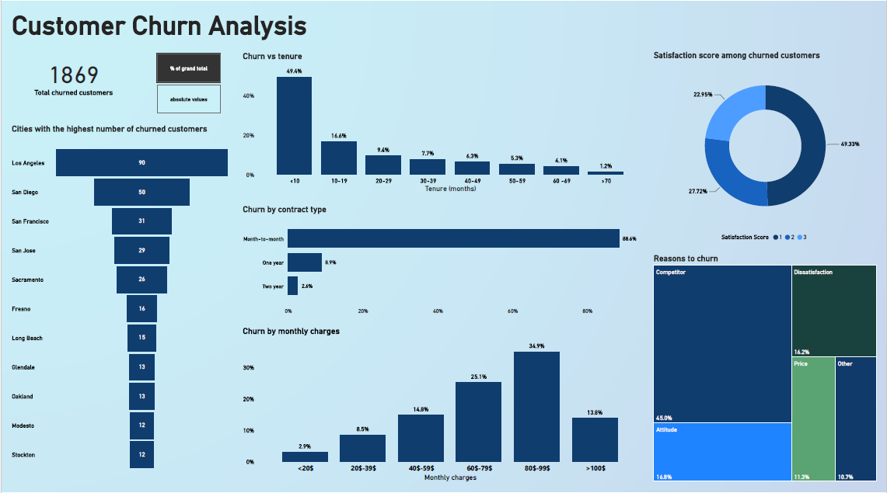

# Customer churn analysis in Power BI

## Analysis
In this project I used Power BI to analyse customer churn data from telecommunications industry.

I analysed customer churn from multiple sides:
- customer tenure,
- contract type(duration),
- monthly subscription charges paid by customers,
- satisfaction score,
- reasons to churn,
- cities where customers churn the most.

### Tenure
Column chart clearly shows the negative correlation between the customer tenure and customer churn: the longer customers use service, the less likely they are to churn.
Almost 50% of customers who churned, did it in less than 10 months of using services. After this period, number of churned customers significantly declines.

### Contract type
We can also observe negative correlation between the contract duration and customer churn. 
Most customers (almost 90%) churn when they use services on month-to-month basis.

### Subscription fee
In general, the more customers pay, the more likely they are to churn (positive correlation) - except group of customers who spend monthly more than 100 $. Customers whose monthly subscription fee ranges between 80 - 99% are the biggest group in this particular breakdown (about 35%).

### Satisfaction score
Customer satisfaction level is measured using 1 - 5 scale where 1 is the lowest satisfaction score and 5 - the highest one. 
All customers who churned expressed lower satisfaction levels (between 1 and 3). What's even more important, about half of them rated 1 - the lowest score.

### Reasons to churn
Reasons to churn were divided into 6 different categories:
- Competitor,
- Attitude,
- Price,
- Dissatisfaction,
- Price,
- Other.

About half of churned customers left because of better offer from competitors. Customers are definitely less likely to churn because of company's attitude, general dissatisfaction (about 16%) or price (about 11%). 

## Dataset
Data was obtained from: https://accelerator.ca.analytics.ibm.com/bi/?perspective=authoring&pathRef=.public_folders%2FIBM%2BAccelerator%2BCatalog%2FContent%2FDAT00148&id=i9710CF25EF75468D95FFFC7D57D45204&objRef=i9710CF25EF75468D95FFFC7D57D45204&action=run&format=HTML&cmPropStr=%7B"id"%3A"i9710CF25EF75468D95FFFC7D57D45204"%2C"type"%3A"reportView"%2C"defaultName"%3A"DAT00148"%2C"permissions"%3A%5B"execute"%2C"read"%2C"traverse"%5D%7D
